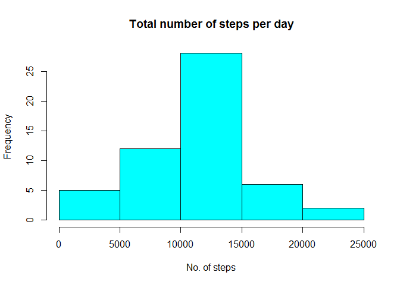
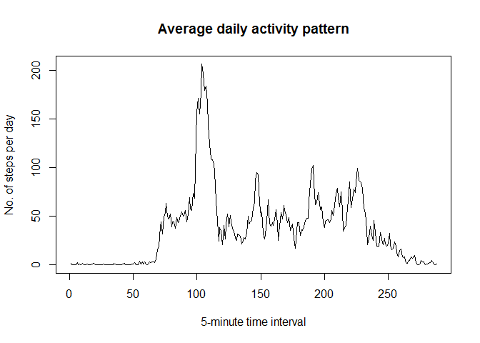
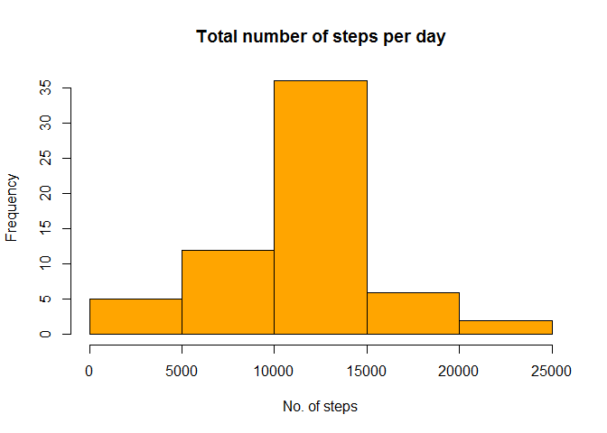
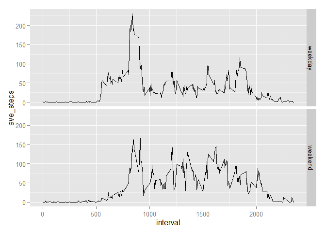

# Reproducible Research: Peer Assessment 1

This document contains the code and answers for the Reproducible Research assignment 1. 

## Loading and preprocessing the data

```r
#Read in the data files
setwd("C:/Users/Pete/Documents/R-files/Course5")
data = read.csv("activity.csv")

library(plyr)
```

```
## Warning: package 'plyr' was built under R version 3.0.3
```

```r
library(lubridate)
```

```
## Warning: package 'lubridate' was built under R version 3.0.3
```

```
## 
## Attaching package: 'lubridate'
## 
## The following object is masked from 'package:plyr':
## 
##     here
```


## What is mean total number of steps taken per day?

1. The total number of steps each day is shown in the table below.


```r
daily_steps = ddply(na.exclude(data), c("date"), summarise, total_steps = sum(steps))
daily_steps
```

```
##          date total_steps
## 1  2012-10-02         126
## 2  2012-10-03       11352
## 3  2012-10-04       12116
## 4  2012-10-05       13294
## 5  2012-10-06       15420
## 6  2012-10-07       11015
## 7  2012-10-09       12811
## 8  2012-10-10        9900
## 9  2012-10-11       10304
## 10 2012-10-12       17382
## 11 2012-10-13       12426
## 12 2012-10-14       15098
## 13 2012-10-15       10139
## 14 2012-10-16       15084
## 15 2012-10-17       13452
## 16 2012-10-18       10056
## 17 2012-10-19       11829
## 18 2012-10-20       10395
## 19 2012-10-21        8821
## 20 2012-10-22       13460
## 21 2012-10-23        8918
## 22 2012-10-24        8355
## 23 2012-10-25        2492
## 24 2012-10-26        6778
## 25 2012-10-27       10119
## 26 2012-10-28       11458
## 27 2012-10-29        5018
## 28 2012-10-30        9819
## 29 2012-10-31       15414
## 30 2012-11-02       10600
## 31 2012-11-03       10571
## 32 2012-11-05       10439
## 33 2012-11-06        8334
## 34 2012-11-07       12883
## 35 2012-11-08        3219
## 36 2012-11-11       12608
## 37 2012-11-12       10765
## 38 2012-11-13        7336
## 39 2012-11-15          41
## 40 2012-11-16        5441
## 41 2012-11-17       14339
## 42 2012-11-18       15110
## 43 2012-11-19        8841
## 44 2012-11-20        4472
## 45 2012-11-21       12787
## 46 2012-11-22       20427
## 47 2012-11-23       21194
## 48 2012-11-24       14478
## 49 2012-11-25       11834
## 50 2012-11-26       11162
## 51 2012-11-27       13646
## 52 2012-11-28       10183
## 53 2012-11-29        7047
```

2. The graph below shows a histogram of the number of steps taken per day.


```r
hist(daily_steps$total_steps, xlab = "No. of steps", main = "Total number of steps per day", col = "cyan")
```

 

3. The mean number of steps per day is:


```r
mean(daily_steps$total_steps)
```

```
## [1] 10766.19
```
and the median is:

```r
median(daily_steps$total_steps)
```

```
## [1] 10765
```


## What is the average daily activity pattern?

1. Below is a time series plot of the average number of steps per day, by five minute interval.


```r
daily_pattern = ddply(na.exclude(data), c("interval"), summarise, total_steps = sum(steps), ave_steps = mean(steps))
plot.ts(daily_pattern$ave_steps, type = "l", xlab = "5-minute time interval",
        ylab = "No. of steps per day", main = "Average daily activity pattern")
```

 

2. The 5-minute interval with the maximum number of steps is the interval commencing at:


```r
daily_max = which.max(daily_pattern$ave_steps)
daily_pattern[daily_max,]
```

```
##     interval total_steps ave_steps
## 104      835       10927  206.1698
```

```r
most_active = daily_pattern[daily_max,1]
```

time 835.

## Imputing missing values


```r
na_data = subset(data, is.na(steps))
```

1. The total number of missing values is 2304.

2. The strategy for filling missing values is to assume that they are are identical to average from the same 5-minute interval over the rest of the days (but rounded using R's round function).  This will result in an integer as the number of steps per interval.

3. A new dataset as revised_data in the code below.


```r
data_for_missing = ddply(na.exclude(data), c("interval"), summarise, ave_steps = round(mean(steps),0))
new_dataset = merge(data, data_for_missing, by.x = "interval", by.y = "interval")
new_dataset = arrange(new_dataset, date, interval)
data_adjusted = mutate(new_dataset, estimate_steps = ifelse(is.na(steps), ave_steps, steps))
revised_data = data_adjusted[,c(5,3,1)]
```

4.The graph below shows a new histogram of the estimated number of steps taken per day.


```r
revised_daily_steps = ddply(revised_data, c("date"), summarise, total_steps = sum(estimate_steps))
hist(revised_daily_steps$total_steps, xlab = "No. of steps", main = "Total number of steps per day", col = "orange")
```

 

The mean number of steps per day is now:


```r
mean(revised_daily_steps$total_steps)
```

```
## [1] 10765.64
```
and the median is now:

```r
median(revised_daily_steps$total_steps)
```

```
## [1] 10762
```

As a result of including estimated values for the missing dates, the mean has fallen slightly and the median has reduced from 10765 to 10762.  This is due to the additional days all being assumed to have the same number of steps as an average day, which was estimated as 10762 (after rounding for each interval)


## Are there differences in activity patterns between weekdays and weekends?

1. The code below creates a new factor variable indicating whether a date is a weekday or weekend:


```r
day = wday(as.Date(data$date,'%Y-%m-%d'), label=TRUE)
data_adj = cbind(revised_data, day)
data_adj = mutate(data_adj, weekday_or_weekend = as.factor(ifelse(day == "Sat" | day == "Sun", "weekend", "weekday")))
```

To prove that we have a new factor variable, the strucure of the data and a sample is below, 

```r
str(data_adj)
```

```
## 'data.frame':	17568 obs. of  5 variables:
##  $ estimate_steps    : num  2 0 0 0 0 2 1 1 0 1 ...
##  $ date              : Factor w/ 61 levels "2012-10-01","2012-10-02",..: 1 1 1 1 1 1 1 1 1 1 ...
##  $ interval          : int  0 5 10 15 20 25 30 35 40 45 ...
##  $ day               : Ord.factor w/ 7 levels "Sun"<"Mon"<"Tues"<..: 2 2 2 2 2 2 2 2 2 2 ...
##  $ weekday_or_weekend: Factor w/ 2 levels "weekday","weekend": 1 1 1 1 1 1 1 1 1 1 ...
```

```r
head(data_adj)
```

```
##   estimate_steps       date interval day weekday_or_weekend
## 1              2 2012-10-01        0 Mon            weekday
## 2              0 2012-10-01        5 Mon            weekday
## 3              0 2012-10-01       10 Mon            weekday
## 4              0 2012-10-01       15 Mon            weekday
## 5              0 2012-10-01       20 Mon            weekday
## 6              2 2012-10-01       25 Mon            weekday
```

2. Below is a plot showing the average number of steps on a weekday compared to on a weekend.

```r
weekly_pattern = ddply(data_adj, c("weekday_or_weekend", "interval"), summarise, ave_steps = mean(estimate_steps))
library(ggplot2)
```

```
## Warning: package 'ggplot2' was built under R version 3.0.3
```

```r
ggplot(weekly_pattern, aes(x = interval, y = ave_steps), type = "l") + geom_line() +
  facet_grid(weekday_or_weekend ~ .)
```

 
